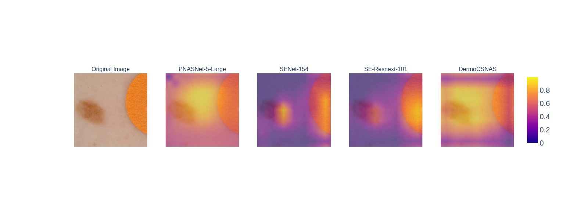
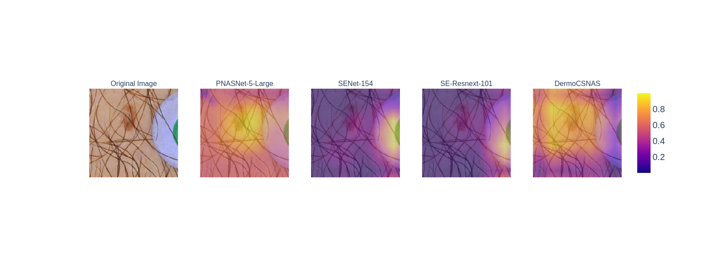
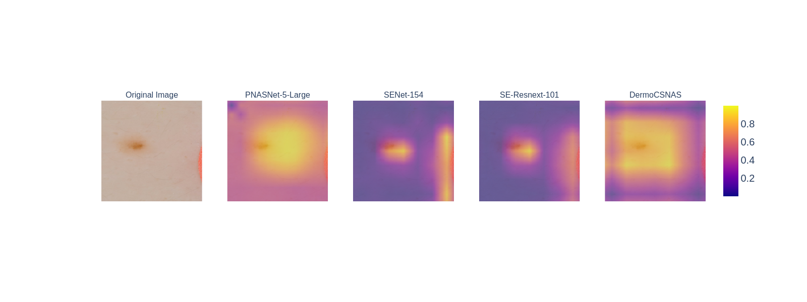

# CSNAS
## Introduction
This is repository for the study "Neural architecture search via contrastive self-supervised learning:Is labeled data necessary for neural architecture search?". We propose a novel approach which leverages the contrastive self-supervised neural architecture search via sequential model-based optimization for searching a well-customized deep neural intelligence to classify skin diseases. First, our approach allows a search procedure on unlabeled skin lesion images by capitalizing on the advancement of self-supervised learning. Hence, it enables the copious usage of both labeled and unlabeled data and then alleviates data curation costs. Second, we conducted an extensive number of experiments to empirically show that our established intelligence outperforms state-of-the-art architectures concerning accuracy and robustness. Finally, our model demonstrates promising results in terms of utilizing for on-device mobile-based deep learning applications. In addition, due to its low energy requirements and better performance, it is well suited for medical image diagnosis under resource constrained environments.

## Overview


### Example CAM from test samples:

{: height="75px" align="left"}
## Requirement
```
python >= 3.5.5, pytorch == 0.3.1, torchvision == 0.2.0, hyperopt, graphviz
```
## Dataset
The ISIC 2019 private test set and public train set can be founded in https://challenge.isic-archive.com/data#2018.
```
[1] Tschandl P., Rosendahl C. & Kittler H. The HAM10000 dataset, a large collection of multi-source dermatoscopic images of common pigmented skin lesions. Sci. Data 5, 180161 doi.10.1038/sdata.2018.161 (2018)

[2] Noel C. F. Codella, David Gutman, M. Emre Celebi, Brian Helba, Michael A. Marchetti, Stephen W. Dusza, Aadi Kalloo, Konstantinos Liopyris, Nabin Mishra, Harald Kittler, Allan Halpern: “Skin Lesion Analysis Toward Melanoma Detection: A Challenge at the 2017 International Symposium on Biomedical Imaging (ISBI), Hosted by the International Skin Imaging Collaboration (ISIC)”, 2017; arXiv:1710.05006.

[3] Marc Combalia, Noel C. F. Codella, Veronica Rotemberg, Brian Helba, Veronica Vilaplana, Ofer Reiter, Allan C. Halpern, Susana Puig, Josep Malvehy: “BCN20000: Dermoscopic Lesions in the Wild”, 2019; arXiv:1908.02288.
```
## Pre-trained Models

## Code usage
Search neural architecture:
```
cd search
python search.py
```
Evaluated discovered model:
```
cd eval
python train_isic.py
```

## Citaion
